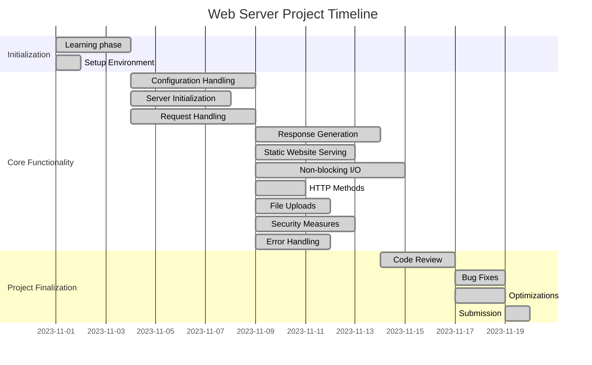
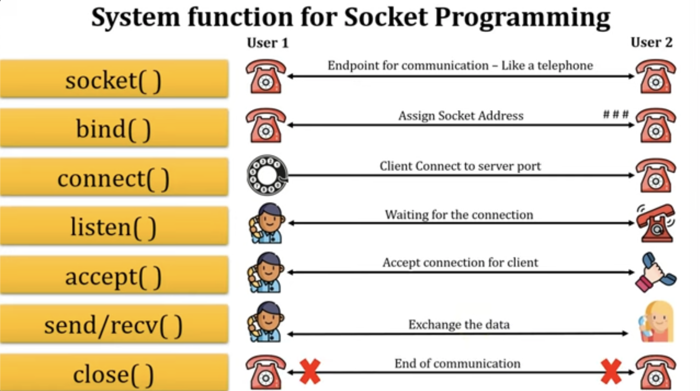

# WebServ



## Resources

[A helpful repo](https://github.com/Kaydooo/Webserv_42)<br>
[About network programming](http://www.cs.columbia.edu/~danr/courses/6761/Fall00/hw/pa1/6761-sockhelp.pdf)<br>
[the RFC](https://www.rfc-editor.org/rfc/rfc9110.html#name-introduction)<br>
[Socket Tutorial](https://www.geeksforgeeks.org/socket-programming-cc/)<br>
[MDN HTTP](https://developer.mozilla.org/en-US/docs/Web/HTTP)<br>
[Sockets](https://w3.cs.jmu.edu/kirkpams/OpenCSF/Books/csf/html/TCPSockets.html)<br>
[Youtube Playlist](https://www.youtube.com/playlist?list=PL2yzsKiNIapNcFWhNAxTGAluY5zLQ-53v) <br>

# Key concepts

Certainly, here are the key concepts you should study before working on a non-blocking web server:

1. **HTTP Protocol**: Understand how the HTTP protocol works, including request methods (GET, POST), response status codes, headers, and URL structure.

2. **Sockets and Networking**: Learn the fundamentals of sockets and network communication to handle client-server interactions.

3. **Non-blocking I/O**: Study non-blocking I/O techniques and mechanisms like `select()`, `poll()`, and `epoll()` to handle multiple clients concurrently.

4. **Multiplexing**: Learn about multiplexing to efficiently manage multiple client connections within a single thread or process.

5. **Asynchronous I/O**: Learn about asynchronous I/O to handle I/O operations without blocking the main server loop.

6. **Web Server Components**: Familiarize yourself with the key components of a web server, such as request parsing, response generation, and routing.

7. **HTTP Request-Response Lifecycle**: Understand the lifecycle of an HTTP request, from client connection to response transmission.

8. **Content Serving**: Learn how to serve both static and dynamic content, including database access and dynamic page generation.

9. **HTTP Headers and MIME Types**: Understand HTTP headers and MIME types to properly set content type and encoding.

# HTTP

<details>

<summary>
HTTP (Hypertext Transfer Protocol) is a protocol for transmitting and receiving data on the World Wide Web, defining how information is requested and presented between web servers and web clients (usually web browsers). Here's a summary of HTTP and its key concepts:
</summary>

1. **RFC (Request for Comments)**: HTTP is defined in a series of RFC documents. The most widely used version is HTTP/1.1, defined in RFC 2616. There's also HTTP/2 (RFC 7540) and HTTP/3 (RFC 7541).

2. **Client-Server Communication**: HTTP is a client-server protocol. Clients (usually web browsers) send requests to servers, and servers respond with resources, such as web pages.

3. **Stateless Protocol**: HTTP is stateless, meaning that each request from a client to a server must contain all the information needed to understand and fulfill the request. There's no memory of previous requests.

4. **Request Methods**:
   - **GET**: Requests a resource (e.g., a web page).
   - **POST**: Submits data to be processed, often used in forms.
   - **PUT**: Uploads a resource to the server.
   - **DELETE**: Removes a resource.
   - And more: HEAD, OPTIONS, PATCH, etc.

5. **URL**: Uniform Resource Locator (URL) is a string that specifies the resource's location on the web, including the protocol (http:// or https://), domain, path, and optional query parameters.

6. **Headers**: Requests and responses contain headers with metadata about the message, such as content type, encoding, and caching instructions.

7. **Status Codes**:
   - **1xx**: Informational.
   - **2xx**: Successful (e.g., 200 OK).
   - **3xx**: Redirection (e.g., 301 Moved Permanently).
   - **4xx**: Client errors (e.g., 404 Not Found).
   - **5xx**: Server errors (e.g., 500 Internal Server Error).

8. **Caching**: Web browsers and servers use caching to store and reuse resources to improve performance and reduce bandwidth usage.

9. **Cookies**: HTTP uses cookies for session management, allowing servers to remember stateful information between requests.

10. **Authentication and Authorization**: HTTP supports various authentication methods to secure resources, such as Basic Authentication and Bearer Tokens.

11. **HTTPS**: HTTP Secure (HTTPS) uses encryption to secure data transmitted between clients and servers. It's essential for protecting sensitive information.

12. **HTTP/2 and HTTP/3**: These newer versions of HTTP introduce improvements, such as multiplexing, header compression, and reduced latency.

13. **MIME Types**: HTTP uses Multipurpose Internet Mail Extensions (MIME) types to specify the content type of resources, which helps clients interpret the data correctly.

14. **Proxies**: Intermediary servers known as proxies can sit between clients and servers, routing and caching requests, and even modifying them.

15. **Web Server**: A web server software (e.g., Apache, Nginx) listens for incoming HTTP requests, processes them, and returns responses.
</details>
<br>

---

# Web Server
<details>

<summary>A web server is a software application that listens for incoming HTTP requests from clients (usually web browsers) and responds by serving web pages and other resources. Here's a simplified overview of how a web server works:
</summary>

1. **Initialization**:
   - The web server software is started and configured to listen on a specific IP address and port, commonly port 80 for HTTP or port 443 for HTTPS.

2. **Listening for Requests**:
   - The web server continuously listens for incoming network connections on the specified port. It uses a socket to accept client connections.

3. **Client Connection**:
   - When a client (e.g., a web browser) wants to access a web page or resource hosted on the server, it initiates a connection to the server's IP address and port.

4. **Request Handling**:
   - Upon receiving a connection request, the server accepts the client's connection and creates a new socket dedicated to that client.
   - The server reads the incoming HTTP request sent by the client. The request includes the requested URL, HTTP method (e.g., GET, POST), headers, and optional data.
   - The server parses the request to determine which resource the client is requesting and what action should be taken.

5. **Resource Retrieval**:
   - Based on the information in the request, the server may need to retrieve the requested resource. Resources can be static (e.g., HTML files, images) or dynamic (e.g., generated web pages from databases).
   - Static resources are typically served directly from the file system, while dynamic content may require additional processing, such as executing server-side scripts (e.g., PHP, Python) or querying a database.

6. **Response Generation**:
   - The server generates an HTTP response, which includes a status code (e.g., 200 OK, 404 Not Found), response headers (e.g., content type, content length), and the response body (the actual content).
   - The response is based on the requested resource and any server-side processing required.

7. **Sending the Response**:
   - The server sends the HTTP response back to the client through the dedicated client socket.
   - The client processes the response, rendering web pages or displaying resources as needed.

8. **Closing the Connection**:
   - After sending the response, the server may choose to close the connection or keep it open for potential reuse, depending on the HTTP version and server configuration.
   
9. **Logging and Error Handling**:
   - The server may log details about the request, such as client IP addresses, requested URLs, and timestamps, for monitoring and debugging.
   - The server handles errors, such as 404 Not Found, and sends appropriate error responses.

10. **Looping for More Requests**:
    - The web server continues listening for and handling incoming client requests in a loop, allowing multiple clients to connect simultaneously.

This process repeats for each client connection, making it possible for multiple clients to access web content simultaneously. Web servers can serve a variety of resources, from static web pages to dynamic web applications, and they play a crucial role in delivering content on the World Wide Web.
</details>
<br>

---

# Sockets
A socket is a software component that represents an endpoint for network communication on your computer. It acts as a communication channel through which data can be sent and received between processes (programs) running on your computer and remote computers over a network, like the internet. Sockets are a fundamental concept in networking and allow applications to communicate with each other,

But what are Sockets?

You've probably heard of IP addresses, right? In a very general sense, an IP address is how you distinguish different machines, or hosts. For example, when you connect to Amazon, you need a way to specify the physical server you want your messages to be sent to. That's what the IP address is for.

Great, right? The IP address helps you distinguish between physical machines (typically called hosts), and that is all you need to do be able to do, right?

Not quite! While IP addressing helps you distinguish between hosts, what about different processes on your computer? When a message (sometimes called a packet, or segment, in this context) reaches your computer, how does your Operating System know which process that message was meant for? You might be browsing reddit while checking your email while playing a game while streaming music. How does your OS know that the message it just received was meant for Spotify or for Web Browsing? The IP address can't distinguish between the two.

This is where ports come in. A port is just a number, but it acts as a kind of "address" so that your operating system can identify which process a message is meant for.

A socket is then a way for your program to say, "Hey, this is My IP Address and my Port Number. Contact me Here!". This way, you can have multiple programs running on the same machine, and the OS can distinguish between your python program and some other process going on.

<details>
<summary>
Here's how sockets work under the hood and what they represent:
</summary>

1. **Data Representation**: Sockets are essentially data structures that hold information needed for communication, such as the remote IP address, port number, and communication protocol (e.g., TCP or UDP). They also include data buffers to store data being sent or received.

2. **API**: Your computer's operating system provides an API (Application Programming Interface) for creating and using sockets. In programming, you use this API to create and manage sockets.

3. **Endpoint**: A socket represents an endpoint of a network connection. Think of it as a "door" through which data can come in or go out. This endpoint is uniquely identified by a combination of the local IP address, local port number, remote IP address, and remote port number.

4. **Connection Establishment**:
   - When you create a socket on your computer, you specify its type (TCP or UDP) and optionally configure it with an IP address and port number.
   - When you want to connect to a remote server (e.g., a web server), you create a client socket and specify the server's IP address and port.
   - When you want to listen for incoming connections, you create a server socket and specify the local port.

5. **Data Transfer**: Data is sent and received through sockets using functions or methods provided by the operating system's networking API. These functions include `send()`, `recv()`, `connect()`, `accept()`, and others.

6. **Connection Termination**:
   - When the communication is complete, sockets are closed to release resources. This is done using the `close()` function.
   - For TCP connections, there is a formal connection termination process, known as the TCP handshake, which ensures reliable data delivery.

7. **Transport Layer**: Sockets are part of the transport layer in the OSI model, which is responsible for end-to-end communication. They provide an interface to the lower-level networking layers that handle routing and data transmission.

8. **Multiplexing**: Sockets can be used for multiplexing, allowing multiple connections to be managed by a single process or thread. This is how a web server, for example, can handle multiple client connections simultaneously.

So, under the hood, a socket represents an endpoint for network communication, holding all the necessary information for sending and receiving data. It's an essential component for applications to communicate over a network, whether it's for browsing the web, sending emails, or any other network-based activity.
</details>

<br>

---

# How socket works with the browser and webserver

1. **Socket Creation**:
   - The web server creates a socket to listen for incoming connections. This is often referred to as the server socket.
   - When a web browser (client) wants to communicate with the server, it creates a socket for that specific connection. This is often referred to as the client socket.

2. **Client-Server Communication**:
   - The web browser (client) initiates a connection to the web server by specifying the server's IP address and port number.
   - The web server accepts the incoming connection request using its server socket.

3. **Request-Response Model**:
   - The web browser sends an HTTP request to the server over the client socket. This request typically includes information about the resource (e.g., a web page) the browser wants to retrieve.
   - The web server receives the request on its server socket, processes the request, and prepares an HTTP response. This response contains the requested data or information.

4. **Data Transfer**:
   - The data (the HTTP request and response) is transmitted between the client and server over the established socket connection. Data can be sent and received in both directions.

5. **Connection Termination**:
   - Once the communication is complete, the client or server may close the socket connection. This frees up resources and indicates the end of the communication for that connection.

6. **Multiple Connections**:
   - Web servers are designed to handle multiple simultaneous connections from various clients. Each client connection is typically represented by a separate socket.

7. **Concurrency and Multithreading**:
   - To manage multiple client connections efficiently, web servers often use techniques like multithreading or asynchronous I/O. This allows the server to handle multiple socket connections concurrently.

8. **Response to Multiple Clients**:
   - The web server can respond to requests from multiple clients simultaneously, allowing users to access web pages and resources concurrently.

---


<br>

# Functions

This section includes the description of the necessary functions to create a web server.


<details>

<summary><a href="">getaddrinfo()</a></summary>

```c++
int getaddrinfo(const char *node, const char *service, const struct addrinfo *hints, struct addrinfo **res);
```

- `node` : The hostname or IP address of the server.
  - If `node` is `NULL`, the IP address of the local host is used.
  - Can be a string representation of an IP address, or a hostname.
    - "hostname"
    - "127.0.0.1"
- `service` : The port number of the server.
  - If `service` is `NULL`, the default port number for the service requested in `hints` is used.
  - Can be a string representation of a port number, or a service name.
    - "80"
    - "http"
- `hints` : A pointer to a `struct addrinfo` that specifies criteria for selecting the socket address structures returned in the list pointed to by `res`.
  - If `hints` is `NULL`, then the returned list includes socket addresses for all socket types, for all protocol families supported by the address family of the specified node, and for the address of the local host.
  - The following fields of the `struct addrinfo` are used:
    - `ai_family` : The address family. The following constants are defined for the `ai_family` field:
      - `AF_INET` : IPv4 Internet protocols
      - `AF_INET6` : IPv6 Internet protocols
      - `AF_UNIX` : Local communication
      - `AF_UNSPEC` : Unspecified
    - `ai_socktype` : The socket type. The following constants are defined for the `ai_socktype` field:
      - `SOCK_STREAM` : Provides sequenced, reliable, two-way, connection-based byte streams. An out-of-band data transmission mechanism may be supported.
      - `SOCK_DGRAM` : Supports datagrams (connectionless, unreliable messages of a fixed maximum length).
      - `SOCK_RAW` : Provides raw network protocol access.
      - `SOCK_RDM` : Provides a reliable datagram layer that does not guarantee ordering.
      - `SOCK_SEQPACKET` : Provides a sequenced packet layer that does not guarantee ordering.
    - `ai_protocol` : The protocol for the socket. The following constants are defined for the `ai_protocol` field:
      - `IPPROTO_TCP` : Transmission Control Protocol
      - `IPPROTO_UDP` : User Datagram Protocol
      - `IPPROTO_RAW` : Raw protocol interface
      - `IPPROTO_IP` : Internet Protocol
      - `IPPROTO_ICMP` : Internet Control Message Protocol
      - `IPPROTO_IGMP` : Internet Group Management Protocol
      - `IPPROTO_IPV4` : Internet Protocol version 4
      - `IPPROTO_IPV6` : Internet Protocol version 6
- `res` : A pointer to a linked list of one or more `struct addrinfo` structures that contains response information about the host.
- Return value : On success, zero is returned. On error, -1 is returned, and `errno` is set appropriately.

- `struct addrinfo` :

```c++
struct addrinfo {
	int ai_flags;               // input flags        
	int ai_family;              // socket protocol family        
	int ai_socktype;            // socket type        
	int ai_protocol;            // protocol for socket        
	socklen_t   ai_addrlen;     // socket address length        
	struct sockaddr *ai_addr;   // socket address        
	char*   ai_canonname;       // service name        
	struct addrinfo *ai_next;   // next item in the list    
}; 
```

</details>

---

<details>

<summary><a href="">socket()</a></summary>

```c++
int socket(int domain, int type, int protocol);
```

- `domain` : The communication domain, which specifies the communication semantics and the protocol family to be used. The following constants are defined for the `domain` argument:
    - `AF_INET` : IPv4 Internet protocols
    - `AF_INET6` : IPv6 Internet protocols
    - `AF_UNIX` : Local communication
    - `AF_UNSPEC` : Unspecified
- `type` : The communication semantics. The following constants are defined for the `type` argument:
    - `SOCK_STREAM` : Provides sequenced, reliable, two-way, connection-based byte streams. An out-of-band data transmission mechanism may be supported.
    - `SOCK_DGRAM` : Supports datagrams (connectionless, unreliable messages of a fixed maximum length).
    - `SOCK_RAW` : Provides raw network protocol access.
    - `SOCK_RDM` : Provides a reliable datagram layer that does not guarantee ordering.
    - `SOCK_SEQPACKET` : Provides a sequenced packet layer that does not guarantee ordering.
- `protocol` : The protocol to be used with the socket. Normally only a single protocol exists to support a particular socket type within a given protocol family, in which case `protocol` can be specified as 0. The following constants are defined for the `protocol` argument:
    - `IPPROTO_TCP` : Transmission Control Protocol
    - `IPPROTO_UDP` : User Datagram Protocol
    - `IPPROTO_SCTP` : Stream Control Transmission Protocol
    - `IPPROTO_TIPC` : Transparent Inter-Process Communication
    - `IPPROTO_RAW` : Raw IP packets
    - '0' : Use default protocol
- Return value : On success, a file descriptor for the new socket is returned. On error, -1 is returned, and `errno` is set appropriately.

</details>

---

<details>


<summary><a href="">bind()</a></summary>

```c++
int bind(int sockfd, const struct sockaddr *addr, socklen_t addrlen);
```

- `sockfd` : The file descriptor of the socket to be bound.
- `addr` : A pointer to a `sockaddr` structure containing the address to be bound to the socket. The length and format of the address depend on the address family of the socket.
- `addrlen` : The size, in bytes, of the address structure pointed to by the `addr` argument.
- Return value : On success, zero is returned. On error, -1 is returned, and `errno` is set appropriately.

</details>

---

<details>

<summary><a href="">listen()</a></summary>

```c++
int listen(int sockfd, int backlog);
```

- `sockfd` : The file descriptor of the socket to be listened.
- `backlog` : The maximum length to which the queue of pending connections for `sockfd` may grow.
- Return value : On success, zero is returned. On error, -1 is returned, and `errno` is set appropriately.

</details>

---

<details>

<summary><a href="">accept()</a></summary>

```c++
int accept(int sockfd, struct sockaddr *addr, socklen_t *addrlen);
```

- `sockfd` : The file descriptor of the socket to be accepted.
- `addr` : A pointer to a `sockaddr` structure. This structure is filled in with the address of the peer socket, as known to the communications layer. The exact format of the address returned addr is determined by the socket's address family. When the returned address is too long to fit in the supplied `sockaddr` structure, the address is truncated.
- `addrlen` : A pointer to a `socklen_t` object which on input specifies the length of the supplied `sockaddr` structure, and on output specifies the length of the stored address.
- Return value : On success, these system calls return a non-negative integer that is a descriptor for the accepted socket. On error, -1 is returned, and `errno` is set appropriately.

</details>

---

<details>

<summary><a href="">recv()</a></summary>

```c++
ssize_t recv(int sockfd, void *buf, size_t len, int flags);
```

- `sockfd` : The file descriptor of the socket to be received.
- `buf` : A pointer to a buffer where the message should be stored.
- `len` : The length in bytes of the buffer pointed to by the `buf` argument.
- `flags` : Specifies the type of message reception. The value is formed by logically OR'ing zero or more of the following values:
    - `MSG_OOB` : Process out-of-band data.
    - `MSG_PEEK` : Peek at incoming messages.
    - `MSG_WAITALL` : Wait for a full request, unless the socket is nonblocking.
    - `MSG_DONTWAIT` : Enables nonblocking operation; if the operation would block, the call fails with the error `EAGAIN` or `EWOULDBLOCK`.
    - `MSG_NOSIGNAL` : Do not generate `SIGPIPE` when writing to a pipe with no one to read it.
    - '0' : Use default flag
- Return value : On success, these calls return the number of bytes received. If no messages are available to be received and the peer has performed an orderly shutdown, `recv()` returns 0. On error, -1 is returned, and `errno` is set appropriately.


</details>

---

<details>

<summary><a href="">send()</a></summary>

```c++
ssize_t send(int sockfd, const void *buf, size_t len, int flags);
```

- `sockfd` : The file descriptor of the socket to be sent.
- `buf` : A pointer to a buffer containing the message to be sent.
- `len` : The length in bytes of the message pointed to by the `buf` argument.
- 'flags' : Specifies the type of message transmission. The value is formed by logically OR'ing zero or more of the following values:
    - `MSG_OOB` : Process out-of-band data.
    - `MSG_DONTROUTE` : Bypass routing, use direct interface.
    - `MSG_DONTWAIT` : Enables nonblocking operation; if the operation would block, the call fails with the error `EAGAIN` or `EWOULDBLOCK`.
    - `MSG_NOSIGNAL` : Do not generate `SIGPIPE` when writing to a pipe with no one to read it.
    - '0' : Use default flag
- Return value : On success, these calls return the number of bytes sent. On error, -1 is returned, and `errno` is set appropriately.

</details>

