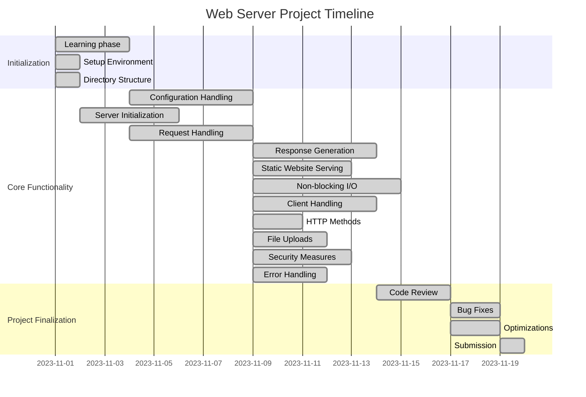

# WebServ

```mermaid
gantt
  title Web Server Project Timeline

  section Initialization
    Learning phase: done, des1, 2023-11-01, 3d
    Setup Environment: done, des2, 2023-11-01, 1d
    Directory Structure: done, des3, 2023-11-01, 1d

  section Core Functionality
    Configuration Handling: done, des4, after des1, 5d
    Server Initialization: done, des5, after des2, 4d
    Request Handling: done, des6, after des1, 5d
    Response Generation: done, des7, after des6, 5d
    Static Website Serving: done, des8, after des6, 4d
    Non-blocking I/O: done, des9, after des6, 6d
    Client Handling: done, des10, after des6, 5d
    HTTP Methods: done, des11, after des6, 2d
    File Uploads: done, des12, after des6, 3d
    Security Measures: done, des13, after des6, 4d
    Error Handling: done, des14, after des6, 3d

  section Project Finalization
    Code Review: done, des15, after des7, 3d
    Bug Fixes: done, des16, after des15, 2d
    Optimizations: done, des17, after des15, 2d
    Submission: done, des19, after des17, 1d

```